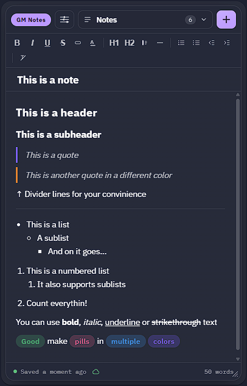
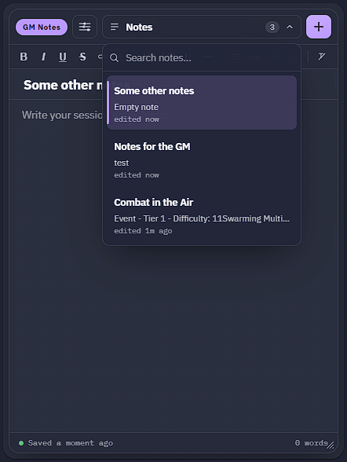
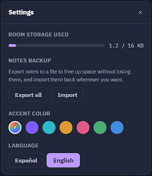

# GM Notes

An [Owlbear Rodeo](https://www.owlbear.rodeo/) extension for a private,
rich-text campaign journal — visible only to the GM.



## Install

Add this extension to your room using its manifest URL:

```
https://notes.ijpedraza.com/manifest.json
```

## Features

- Rich text: bold, italic, underline, strikethrough, headings, color pills,
  text color, colored blockquotes, dividers, and bulleted/numbered lists
  (with indent for sub-lists).
- Multiple notes per room, with search and a quick switcher.
- **Paste recognizes Markdown** — headings, `**bold**`/`*italic*`, lists,
  `> quotes`, and `---` dividers all convert straight into real formatting
  instead of landing as literal symbols.
- **Export/import**: back up a note (or all of them) to a file — a single
  `.json`, or a `.zip` with one file per note when exporting several at
  once — and bring them back later, or move them to another device.
- Personal accent color and language (English/Spanish) per player.



## Where notes are stored

Notes are stored locally on your device (in the browser's own storage),
scoped to the room — not in Owlbear's shared room data, so GM Notes never
competes with other extensions for space. The trade-off: a note only shows
up on the device it was written on. To bring your notes to another device,
export them (Settings has an "export all" option) and import the file
there — or export as a backup any time you like.



## Support

Found a bug or have a feature request? Open an issue at
<https://github.com/nachoijp/owlbear-gm-notes/issues>.
