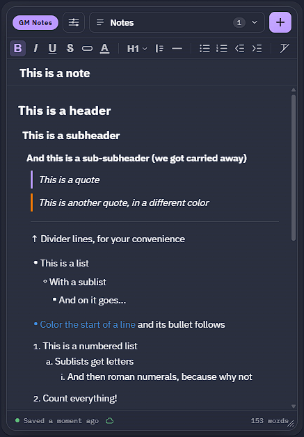
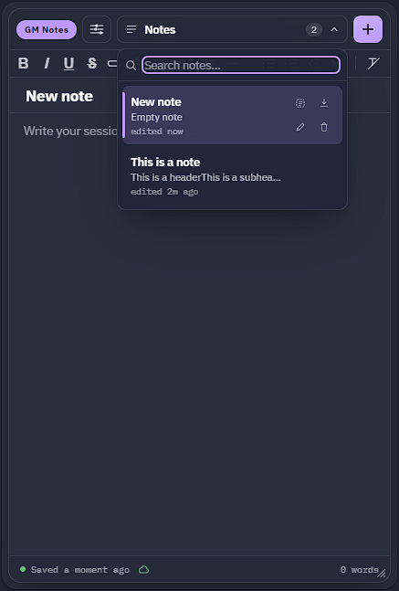
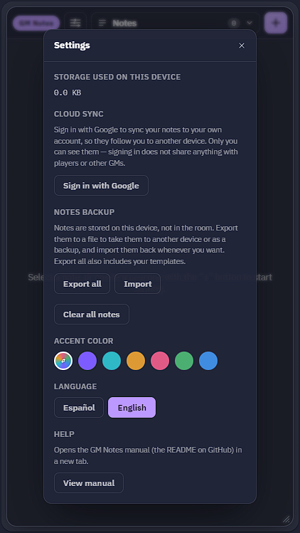

# GM Notes

An [Owlbear Rodeo](https://www.owlbear.rodeo/) extension for a private,
rich-text campaign journal — visible only to the GM.



## Install

Add this extension to your room using its manifest URL:

```
https://notes.ijpedraza.com/manifest.json
```

## Features

- Rich text: bold, italic, underline, strikethrough, headings, color pills,
  text color, colored blockquotes, dividers, and bulleted/numbered lists
  (with indent for sub-lists).
- Multiple notes per room, with search and a quick switcher.
- **Templates**: start a note from a ready-made layout instead of a blank
  page — see [Templates](#templates) below.
- **Paste from anywhere**: pasted text keeps its Markdown formatting —
  headings, `**bold**`/`*italic*`, lists, `> quotes`, and `---` dividers all
  show up styled instead of as raw symbols.
- **Export and import**: save a note (or all of them at once) as a file, and
  bring it back whenever you want. Choose JSON to keep everything exactly
  as it was, or Markdown for a plain-text copy you can read or edit
  anywhere else.
- Personal accent color and language (English/Spanish) per player.



## Templates

The **+** button lets you start a blank note or begin from a template, so
recurring notes — an NPC, a location, the plan for next session — always
start with the right sections in place.

- **Four templates come ready to use**: NPC, Location, Session prep, and
  Session recap. They follow your chosen language, and a note you create
  from one keeps that language from then on.
- **Make your own**: set up any note the way you like, then save it as a
  template with the template button on its row in the notes list.
- **Rename or delete** templates right from the **+** menu.
- Templates are available in **every room**, not just the one you made
  them in. They're included when you export all your notes, and they sync
  across devices along with your notes when you're signed in.

## Notes live on your device — with optional cloud sync

Each note is saved on the device you wrote it on. To bring a note
somewhere else, or just keep a backup, export it (or all your notes at
once, from Settings) and import the file wherever you need it.

Want your notes and templates on more than one device automatically?
Sign in with Google from Settings and they'll sync in the background — no setup
beyond that one sign-in. It's entirely optional and only you can see
your own notes; signing in doesn't share anything with players or other
GMs.



## Support

Found a bug or have a feature request? Open an issue at
<https://github.com/nachoijp/owlbear-gm-notes/issues>.
