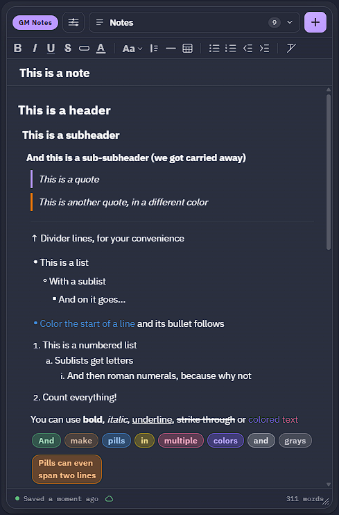
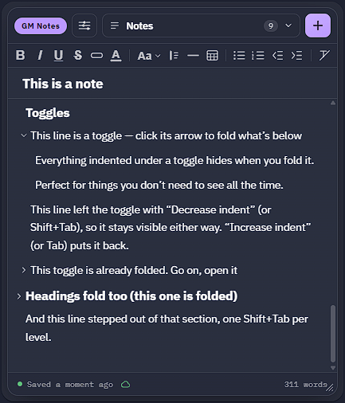
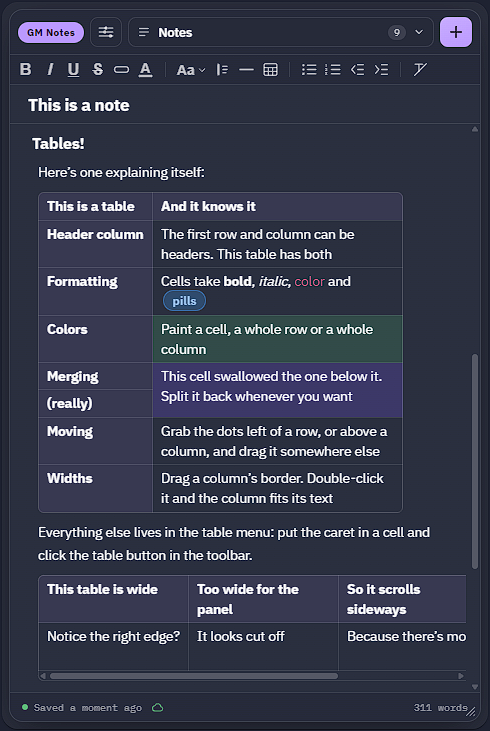
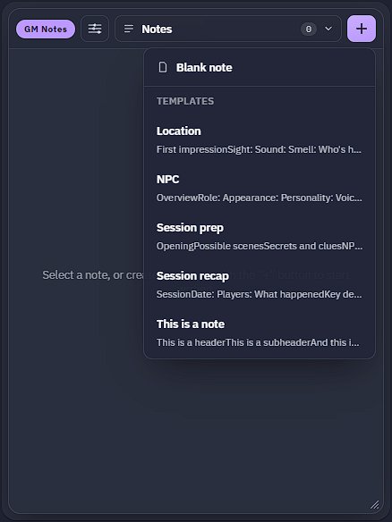

# GM Notes

An [Owlbear Rodeo](https://www.owlbear.rodeo/) extension for a private,
rich-text campaign journal — visible only to the GM.


## Install

Add this extension to your room using its manifest URL:

```
https://notes.ijpedraza.com/manifest.json
```

## Features

- Rich text: bold, italic, underline, strikethrough, three heading levels,
  color pills, text color, colored blockquotes, dividers, and
  bulleted/numbered lists (with indent for sub-lists). Color the start of a
  list item and its bullet or number takes the same color.
- **Tables**: header rows and columns, cell colors, merged cells, columns
  you can resize, and rows and columns you can drag around — see
  [Tables](#tables) below.
- **Collapsible sections**: fold any heading to hide everything under it,
  and use toggles to tuck details away inside normal-looking text — see
  [Collapsible sections](#collapsible-sections) below.
- Multiple notes per room, with search and a quick switcher.
- **Templates**: start a note from a ready-made layout instead of a blank
  page — see [Templates](#templates) below.
- **Copy and paste between notes** keeps all the formatting — pills, colors,
  headings, lists, and quotes come along as they were.
- **Paste from anywhere**: text from other apps comes in clean, without
  stray fonts or colors, and Markdown is recognized — headings,
  `**bold**`/`*italic*`, lists, `> quotes`, `---` dividers, and tables all
  show up styled instead of as raw symbols.
- **Export and import**: save a note (or all of them at once) as a file, and
  bring it back whenever you want. Choose JSON to keep everything exactly
  as it was, or Markdown for a plain-text copy you can read or edit
  anywhere else.
- Personal accent color and language (English/Spanish) per player.
- Resizable panel: drag the corner handle, or double-click it to return to
  the default size.




## Collapsible sections

Long notes stay easy to scan: click the arrow next to any heading (or put
the cursor in it and press **Ctrl+Enter**) to fold everything under it, up
to the next heading of the same or a higher level. Fold a whole chapter to
see just its outline, then open only the part you need at the table.

- Pick the block type from the toolbar's block menu: **Normal text**,
  **Heading 1–3**, or **Toggle**.
- **Toggles** look exactly like normal text, but fold the lines below them
  — handy for secret details, stat blocks, or read-aloud text you only
  want to open when it comes up.
- To continue writing outside a toggle or heading, use **Decrease indent**
  (or **Shift+Tab**) on the line: it steps out one section at a time, and
  **Increase indent** (or **Tab**) puts it back.
- Lines are indented a little for each section they're inside, so you can
  always see which heading or toggle a line belongs to.
- Folding a section doesn't count as editing the note: it won't move the
  note to the top of your list.



## Tables

Insert a table from the toolbar's table button, picking its size from a
grid. Put the cursor in a cell and the same button opens the table menu,
with everything else:

- **Headers**: make the first row, the first column, or both into headers.
- **Colors**: paint a cell, a whole row, or a whole column.
- **Merge and split** cells, to the right or down.
- **Move rows and columns**: drag the dots to the left of a row or above a
  column, or use **Alt+Shift+arrows**.
- **Widths**: drag a column's border to resize it, or double-click the
  border and the column fits its text. The menu can also even out the
  columns, fit them all to their content, or fit the table to the panel.
- Tables wider than the panel scroll sideways, and their edge looks cut off
  so you can tell there's more.



## Templates

The **+** button lets you start a blank note or begin from a template, so
recurring notes — an NPC, a location, the plan for next session — always
start with the right sections in place.

- **Templates come ready to use**: NPC, Location, Session prep, Session
  recap, and empty stat blocks for a D&D 5e monster and a Daggerheart
  adversary or environment — plus **This is a note**, a quick tour of every formatting
  option that you can delete once you've had a look. They follow your
  chosen language, and a note you create from one keeps that language from
  then on.
- **Make your own**: set up any note the way you like, then save it as a
  template with the template button on its row in the notes list.
- **Rename or delete** templates right from the **+** menu. Deleted one of
  the built-in templates? **Restore default templates**, at the bottom of
  the same menu, brings it back.
- Templates are available in **every room**, not just the one you made
  them in. They're included when you export all your notes, and they sync
  across devices along with your notes when you're signed in.



## Notes live on your device — with optional cloud sync

Each note is saved on the device you wrote it on. To bring a note
somewhere else, or just keep a backup, export it (or all your notes at
once, from Settings) and import the file wherever you need it.

Want your notes and templates on more than one device automatically?
Sign in with Google from Settings and they'll sync in the background — no setup
beyond that one sign-in. It's entirely optional and only you can see
your own notes; signing in doesn't share anything with players or other
GMs.


## Support

Found a bug or have a feature request? Open an issue at
<https://github.com/nachoijp/owlbear-gm-notes/issues>.
